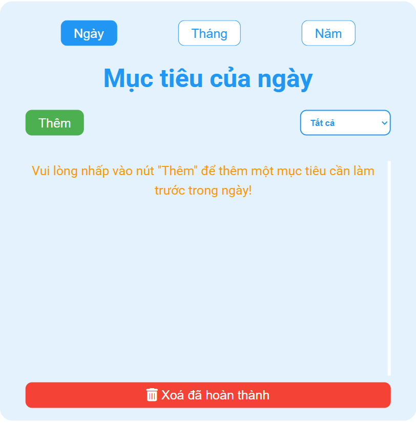

# 🎯 Todo List

### Link: https://todo-list-by-nguyen-cuong.vercel.app

## 🚀 Key Features
### ✅ Manage goals by day / month / year.

### ➕ Add, ✏️ edit, 🗑️ delete goals easily.

### 🔍 Filter goals based on time.

### 🔔 Notifications for due or completed tasks.

### 🔊 Sound alert when a task is due.

### 🧠 Delete confirmation to prevent accidental removals.

### 💾 Persist data using localStorage (no data loss on refresh).

### 📱 Responsive UI for both desktop and mobile.

### 🎨 Styled with SCSS for a smooth visual experience.

### 💡 Uses Font Awesome for intuitive icons.

## 🛠️ Tech Stack
### ⚛️ ReactJS

### 📦 React Redux

### 🪝 React Hook Form

### ✅ Yup (for validation)

### 🎨 Sass / SCSS

### 💾 localStorage
